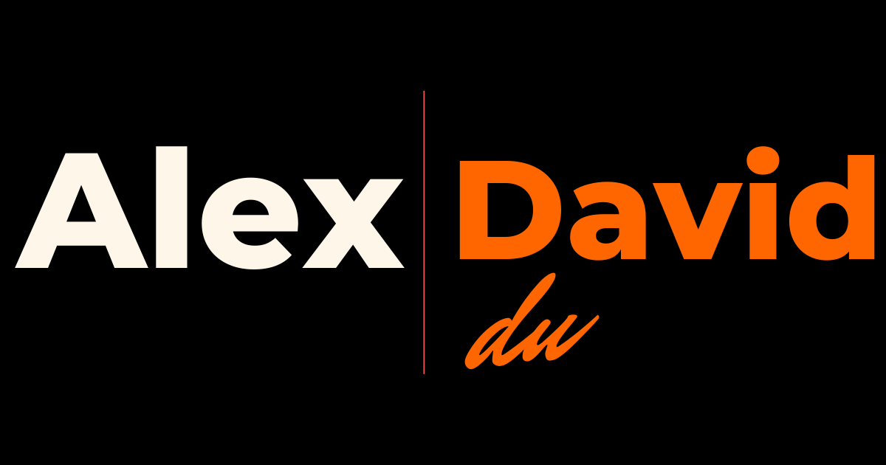

<p align="center">
  
</p>

<h2 align="center">MyPortfolio</h2>

<p align="center">
  A Laravel 12 powered portfolio and blog platform with an integrated admin dashboard, SEO tools, and contact management.  
</p>

<p align="center">
  🌐 <a href="https://byalexdavid.com">Website</a> • 
  🎥 <a href="https://www.youtube.com/@ByAlexdavid">YouTube</a> • 
  💼 <a href="https://www.linkedin.com/in/alex-david-du-ba01601b1/">LinkedIn</a> • 
  💻 <a href="https://github.com/Alexdavid1996">GitHub</a>
</p>

---

## 🚀 Project Overview

### Technologies
- PHP 8.2 with the Laravel 12 framework  
- Blade templating with Blade UI Kit Heroicons  
- Tailwind CSS v3 with PostCSS and Autoprefixer  
- Vite build tool with Axios and Concurrently  
- Alpine.js for lightweight interactivity  
- Mews Purifier for HTML sanitization  
- Database support for SQLite/MySQL via Laravel's Eloquent ORM  

### Features
- Showcase portfolio projects, skills, and job experience  
- Blog with categories, publish dates, excerpts, and SEO fields  
- Admin dashboard to manage CV, portfolio, blog posts, categories, services, and site settings  
- Contact form with centralized inbox  
- SEO ready (meta tags, OG tags, Twitter cards, canonical URLs)  
- Installer with setup wizard  

---

## 🛠️ Installation

1. Clone the repo or download the release  
2. Upload the files to your server  
3. Set permissions for `storage/` and `bootstrap/cache/`  
   ```bash
   chmod -R 775 storage
   chmod -R 775 bootstrap/cache
